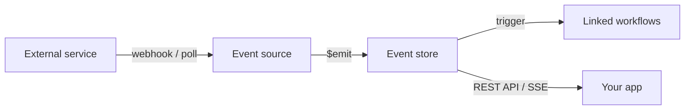

Event sources are the input layer of Pipedream. They watch a service — GitHub, Slack, Airtable, RSS, or any HTTP endpoint — and emit a structured event each time something new happens. Those events can trigger workflows, or you can pull them directly via REST API or SSE stream.

<CardGroup cols={2}>
  <Card title="HTTP source" icon="globe" href="/sources/overview#http-sources">
    Accept any HTTP request and emit it as an event immediately.
  </Card>
  <Card title="Timer source" icon="clock" href="/sources/overview#polling-sources">
    Poll an API on a schedule and emit new results.
  </Card>
  <Card title="Webhook source" icon="webhook" href="/sources/overview#webhook-sources">
    Receive webhook payloads from services like GitHub or Stripe.
  </Card>
  <Card title="Custom source" icon="code" href="/components/quickstart">
    Build your own source for any API in minutes.
  </Card>
</CardGroup>

## How event sources work

A source is a small JavaScript module that Pipedream runs on your behalf. The lifecycle looks like this:



1. The source **receives** data — either via an inbound webhook or by polling an API on a timer.
2. The source calls `this.$emit(event, metadata)` to publish each new event.
3. Pipedream stores the event and immediately triggers any workflows linked to that source.
4. Events are also accessible via the [REST API](#consuming-events-via-rest-api) and a [real-time SSE stream](#consuming-events-via-sse).

## HTTP sources

The simplest source exposes a unique HTTPS endpoint. Send any request to that URL and Pipedream emits the request body, headers, and query parameters as an event.

```javascript
export default {
  name: "http",
  version: "0.0.1",
  props: {
    http: "$.interface.http",
  },
  run(event) {
    // event.method, event.path, event.headers, event.body, event.query
    console.log(event);
  },
};
```

When you deploy this source, Pipedream generates a unique URL like `https://en1234abcd.m.pipedream.net`. Every HTTP request to that URL triggers `run(event)` and emits the event.

## Polling sources

Polling sources run on a timer and call an external API to check for new data. Use the `$.interface.timer` prop to set the interval, and call `this.$emit()` for each new item found.

```javascript
export default {
  name: "cron",
  version: "0.0.1",
  props: {
    timer: {
      type: "$.interface.timer",
      default: {
        intervalSeconds: 60 * 15, // every 15 minutes
      },
    },
  },
  async run({ $ }) {
    const response = await $.http.get("https://api.example.com/items");
    for (const item of response.data.items) {
      this.$emit(item, {
        id: item.id,         // deduplication key
        summary: item.title,
        ts: Date.parse(item.created_at),
      });
    }
  },
};
```

<Note>
Set `dedupe: "unique"` on your source to ensure each event `id` is only emitted once — even if the same item appears in multiple polling runs.
</Note>

## Webhook sources

Webhook sources register a webhook with a third-party service on deploy and receive events pushed in real time. Many pre-built sources — like `github-new-commit` or `slack_bot-new-message-in-channel` — work this way.

The GitHub new-commit source, for example, registers a `push` webhook on your repository and emits one event per commit:

```javascript
// Simplified from components/github/sources/new-commit/new-commit.mjs
export default {
  key: "github-new-commit",
  name: "New Commit",
  version: "1.0.13",
  type: "source",
  dedupe: "unique",
  // ...
  methods: {
    getWebhookEvents() {
      return ["push"];
    },
    async onWebhookTrigger(event) {
      const { body } = event;
      body.commits.forEach((commit) => {
        this.emitEvent({ id: commit.id, item: commit });
      });
    },
  },
};
```

## Deduplication

Polling sources often see the same items across multiple runs. The `dedupe` field tells Pipedream how to handle this:

| Strategy | Behaviour |
|---|---|
| `unique` | Skip any event whose `id` has been emitted before. |
| `last` | Emit only if the event `id` is different from the last emitted id. |
| `greatest` | Emit only if the event `id` is numerically greater than the last emitted id. |

```javascript
export default {
  name: "rss",
  version: "0.0.1",
  dedupe: "unique",
  // ...
  async run() {
    const items = await fetchFeedItems(this.url);
    for (const item of items) {
      this.$emit(item, {
        id: item.guid,       // must be stable across runs
        summary: item.title,
        ts: Date.parse(item.pubDate),
      });
    }
  },
};
```

## Pre-built sources

Pipedream ships hundreds of sources for popular APIs. Find them in the [components directory](https://github.com/PipedreamHQ/pipedream/tree/master/components) or browse by app in the UI.

**A few examples:**

- `github-new-commit` — emits each new commit pushed to a branch
- `github-new-issue-with-status` — emits when a GitHub Project item changes status
- `slack_bot-new-message-in-channel` — emits each new Slack message in a channel
- `github-new-release` — emits when a new GitHub release is published
- `github-new-or-updated-pull-request` — emits when a PR is opened or updated

## Consuming events via REST API

Events emitted by a source are stored and accessible via the Pipedream REST API.

```bash
# List the most recent events from a source
curl -H "Authorization: Bearer $PD_API_KEY" \
  https://api.pipedream.com/v1/sources/{source_id}/events
```

This returns a paginated list of event objects. Each object includes the original emitted payload plus metadata (`id`, `ts`).

## Consuming events via SSE

For real-time consumption, subscribe to the SSE stream for a source. Each emitted event is pushed to the stream immediately.

```bash
curl -H "Authorization: Bearer $PD_API_KEY" \
  https://api.pipedream.com/sources/{source_id}/sse
```

The stream stays open and delivers events as `data:` lines in the [Server-Sent Events](https://developer.mozilla.org/en-US/docs/Web/API/Server-sent_events/Using_server-sent_events) format.

## Next steps

<CardGroup cols={2}>
  <Card title="How sources trigger workflows" icon="bolt" href="/sources/triggers">
    Learn how emitted events become workflow runs.
  </Card>
  <Card title="Component quickstart" icon="rocket" href="/components/quickstart">
    Build and deploy your first custom source in under 5 minutes.
  </Card>
  <Card title="Component API reference" icon="book" href="/components/api">
    Full reference for props, lifecycle methods, and metadata fields.
  </Card>
  <Card title="Component guidelines" icon="list-checks" href="/components/guidelines">
    Standards and best practices for building and contributing components.
  </Card>
</CardGroup>
