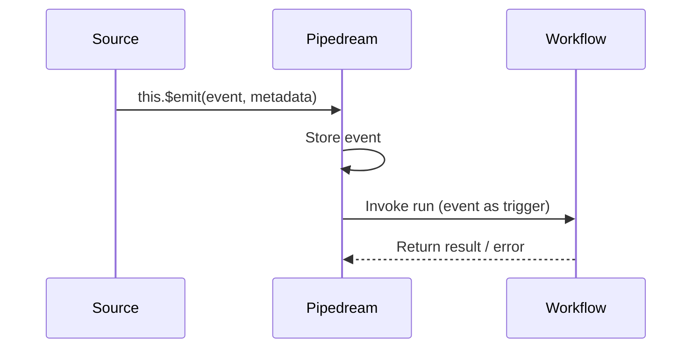

When a source emits an event, Pipedream checks whether any workflows are linked to that source. If they are, Pipedream creates a new workflow run for each emitted event and passes the event as the trigger payload.

## How triggering works



1. Your source calls `this.$emit(event, metadata)`.
2. Pipedream stores the event and routes it to every linked workflow.
3. Each workflow receives the event as `steps.trigger.event` in its first step.
4. If deduplication is configured, Pipedream checks the event `id` before triggering. Duplicate ids are silently dropped.

## The trigger payload

Inside a workflow, `steps.trigger.event` contains the raw object you passed to `this.$emit()`. For an HTTP source, that looks like:

```javascript
// steps.trigger.event for an HTTP source
{
  method: "POST",
  path: "/",
  headers: {
    "content-type": "application/json",
    "x-custom-header": "value"
  },
  body: {
    user_id: 42,
    action: "signup"
  },
  query: {}
}
```

For a polling source like the GitHub new-commit source, `steps.trigger.event` is the raw commit object from the GitHub API:

```javascript
// steps.trigger.event for github-new-commit
{
  sha: "abc123def456...",
  commit: {
    message: "fix: correct off-by-one in pagination",
    author: {
      name: "Jane Smith",
      date: "2026-03-14T10:22:00Z"
    }
  },
  html_url: "https://github.com/org/repo/commit/abc123"
}
```

The trigger metadata — `id`, `summary`, and `ts` — is available at `steps.trigger.context`.

## Linking a source to a workflow

When you create a workflow, you choose a trigger. Selecting an existing event source links that source to the workflow. You can link the same source to multiple workflows, and each workflow receives a copy of every emitted event.

<Note>
A single source can trigger multiple workflows simultaneously. Pipedream invokes all linked workflows independently for each emitted event.
</Note>

## Trigger types

<AccordionGroup>
  <Accordion title="HTTP trigger" defaultOpen={false}>
    Exposes a unique HTTPS endpoint. Each incoming request becomes one workflow run. The `run(event)` method receives:

    ```javascript
    {
      method: "POST",       // HTTP method
      path: "/",            // URL path after the hostname
      headers: {},          // all request headers
      body: {},             // parsed JSON body (or raw string)
      query: {}             // query string parameters
    }
    ```

    You can respond to the HTTP request from within the workflow using `$.respond()`:

    ```javascript
    export default defineComponent({
      async run({ steps, $ }) {
        $.respond({
          status: 200,
          body: { ok: true },
        });
      },
    });
    ```
  </Accordion>

  <Accordion title="Timer trigger" defaultOpen={false}>
    Runs the source `run()` method on a cron schedule or at a fixed interval. Configure using the `$.interface.timer` prop:

    ```javascript
    props: {
      timer: {
        type: "$.interface.timer",
        default: {
          intervalSeconds: 900, // every 15 minutes
          // OR use a cron expression:
          // cron: "0 9 * * 1-5"  // 9am weekdays
        },
      },
    },
    ```

    The `run()` method receives a `{ $ }` context object but no incoming request data. The source is responsible for fetching new data from an external API and calling `this.$emit()` for each new item.
  </Accordion>

  <Accordion title="Webhook trigger" defaultOpen={false}>
    On deployment, the source registers a webhook URL with the target service (GitHub, Stripe, etc.). The service sends HTTP POST requests to that URL when events occur. The source processes the payload and calls `this.$emit()` for relevant events.

    Unlike HTTP sources, webhook sources typically include filtering logic — for example, the GitHub new-issue-with-status source checks whether the `Status` field actually changed before emitting:

    ```javascript
    isRelevant(event) {
      const fieldChanged = event.changes?.field_value?.field_name;
      if (fieldChanged !== "Status") return false;
      // additional checks...
      return true;
    },
    ```

    Pipedream manages webhook registration and deletion automatically when you deploy or delete a source.
  </Accordion>
</AccordionGroup>

## Event ordering and concurrency

By default, Pipedream triggers workflow runs as events arrive. Multiple events emitted in the same polling run are delivered in the order they were passed to `this.$emit()` — sort your items by timestamp before emitting if order matters.

For workflows that must not run concurrently, configure **concurrency controls** in the workflow settings. Options include:

- **Serial** — queue runs and process one at a time
- **Throttle** — cap the number of runs per second/minute
- **Backpressure** — drop or hold new events when the queue is full

## Error handling and retries

If a workflow run fails (unhandled exception or timeout), Pipedream marks the run as errored. You can configure automatic retries in workflow settings. Pipedream will re-invoke the workflow with the original trigger event up to the configured number of times.

<Warning>
Retries re-deliver the same trigger event. If your workflow has side effects (sending an email, writing to a database), make your steps idempotent or check whether the action was already completed before executing it.
</Warning>

## Inspecting trigger events

Every emitted event is stored in the source's event log. You can inspect it in the Pipedream UI under **Sources > [your source] > Events**, or fetch it via the REST API:

```bash
curl -H "Authorization: Bearer $PD_API_KEY" \
  "https://api.pipedream.com/v1/sources/{source_id}/events?limit=10"
```

Each event in the response includes:

```json
{
  "id": "evt_abc123",
  "indexed_at_ms": 1710412800000,
  "event": {
    // your original $emit payload
  },
  "metadata": {
    "id": "commit_sha_here",
    "summary": "New commit: fix pagination",
    "ts": 1710412799000
  }
}
```

## Next steps

<CardGroup cols={2}>
  <Card title="Build your first source" icon="rocket" href="/components/quickstart">
    Step-by-step guide to building and deploying a custom event source.
  </Card>
  <Card title="Component API reference" icon="book" href="/components/api">
    Full reference for $emit, props, and component metadata.
  </Card>
</CardGroup>
